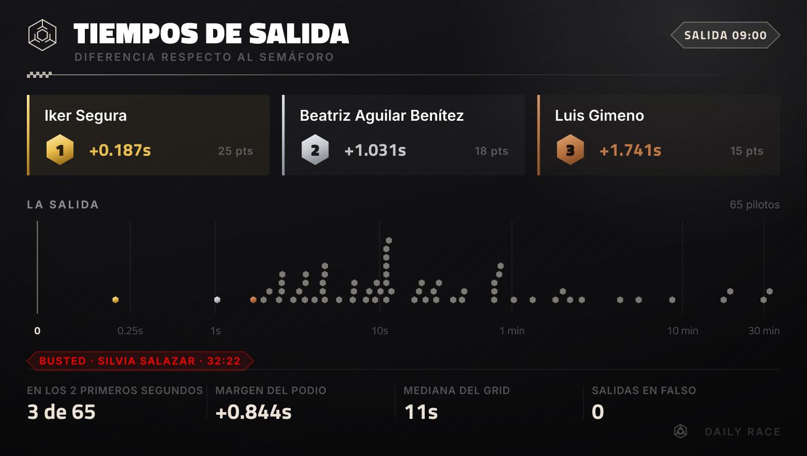
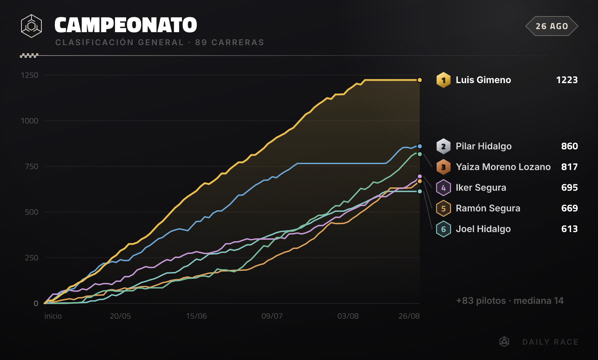

# Daily Race

Sistema de gamificacion de la daily standup de Secture con tematica de carreras de Formula 1.

Cada dia laborable, el sistema monitoriza en tiempo real la reunion de Google Meet de la daily. Cuando detecta que la reunion esta activa, publica un grid en directo en Discord que se actualiza conforme van entrando los participantes. Al terminar la reunion, persiste los resultados, calcula puntos con el sistema de puntuacion F1 y publica la clasificacion general del campeonato.

Todo es automatico, no hay que hacer nada manualmente.

## Como funciona el juego

### La carrera diaria

La daily de Secture esta programada de lunes a viernes. El sistema usa la hora del evento de Google Calendar como **green light** (luz verde). Cada participante que entra a la reunion de Google Meet se convierte en un **driver** (piloto), y su posicion en la **starting grid** (parrilla de salida) se determina por el orden de entrada.

- El primero en entrar (despues del green light) es **P1** y obtiene 25 puntos
- El segundo es **P2** con 18 puntos, y asi sucesivamente siguiendo la tabla F1
- Si entras antes de la hora programada, cuentas como **salida en falso** y recibes una penalizacion

### Sistema de puntuacion F1

| Posicion | Puntos |
|----------|--------|
| P1       | 25     |
| P2       | 18     |
| P3       | 15     |
| P4       | 12     |
| P5       | 10     |
| P6       | 8      |
| P7       | 6      |
| P8       | 4      |
| P9       | 2      |
| P10+     | 1 (asistencia) |
| Salida en falso | -5 (penalizacion) |

### Salidas en falso

Si entras a la reunion **antes de la hora programada** (green light), el sistema lo detecta como salida en falso:

- Recibes **-5 puntos** de penalizacion
- Tu posicion se mueve al **final del grid**: cuanto mas pronto entres, peor posicion
- Ejemplo: si hay 18 participantes y 3 entran antes de hora, estos ocuparan las posiciones 18, 17 y 16 (el mas madrugador en P18)
- Las salidas en falso NO cuentan para victorias ni podios en el championship

### Empates al entrar

Entrar en el mismo instante pasa mas de lo que parece: en **37 de las 89 carreras** medidas, casi siempre porque quien ya esta en la sala cuando arranca la reunion recibe todo el grupo el mismo timestamp de Google Meet.

Los empatados **comparten posicion y puntos**, como en cualquier deporte: dos a la vez son los dos P1, con 25 puntos cada uno, y el siguiente es P3. No hay P2.

Antes lo decidia el orden en que Google Meet devolvia los participantes, que no esta especificado en ninguna parte: eso reparte 73 puntos a dedo en una temporada, y tres veces decidio quien se llevaba 25 y quien 18.

Compartir la posicion infla algo los puntos del dia, pero muy poco y esta medido: **2 puntos de media por carrera afectada y 7 en el peor caso**. Los grupos grandes de empate (de 3 a 8 personas) caen todos en las posiciones 22 a 39, en la zona de asistencia donde cada uno lleva 1 punto, asi que ahi compartir no cambia nada.

### Busted

Cada carrera tiene un **Busted** (marcado con calavera 💀 en Discord):

- **Si hay salidas en falso**: el que entro mas temprano (el mas alejado del green light) se lleva la calavera
- **Si NO hay salidas en falso**: el ultimo en entrar se lleva la calavera
- **Si el extremo esta empatado**: la calavera es de todos los empatados. A igualdad de culpa no hay motivo para senalar a uno solo. De tres en adelante se cuenta el resto en vez de enumerarlo, para que la etiqueta siga cabiendo

### Championship (clasificacion general)

Los puntos se acumulan carrera a carrera en una clasificacion general:

| Columna | Significado |
|---------|-------------|
| **Pos** | Posicion en la clasificacion |
| **Piloto** | Nombre del driver |
| **Pts** | Puntos totales acumulados |
| **W** | Victorias (veces en P1 sin salida en falso) |
| **PD** | Podios (veces en P1-P3 sin salida en falso) |

La clasificacion se ordena por puntos totales de mayor a menor, y los empates se rompen en este orden:

1. **Mas dailies asistidas.** En la F1 el desempate es el countback de resultados porque todos corren todos los GP, asi que lo unico que distingue es la calidad del resultado. Aqui la asistencia va de 1 a 82 dailies sobre 89, o sea que es el dato que de verdad distingue, y es justo el que el juego intenta mover
2. **Menos salidas en falso.** Con los datos actuales no rompe ningun empate, pero es el criterio que expresa la puntualidad y algun dia disparara
3. **Orden alfabetico.** No premia nada, y esta ahi por un motivo concreto: sin una clave determinista al final, los empates que quedan (23 en la temporada medida, todos de gente con puntos y asistencia identicos) caen en el orden que devuelva la base y la tabla cambia de orden entre publicaciones

No hay columna de carreras disputadas (GP), y no es un olvido: la fila del embed tiene un presupuesto de 33 celdas y pasarse rompe la linea en los clientes estrechos de Discord. El numero de carreras ya sale en la linea de resumen del mensaje, y ademas es casi el mismo para todo el mundo, asi que era la columna que menos aportaba por celda ocupada.

### Horario del monitor

El sistema monitoriza la reunion de Google Meet:

- **Cada 5 segundos**
- **De lunes a viernes**
- **De 8:00 a 11:59** (Europe/Madrid), la ventana `8-11` del cron

La ventana cubre cuatro horas y no solo la de la daily porque hay gente que entra a la sala mucho antes: si el poll arranca despues de la primera entrada, esa entrada no se ve y la salida en falso no se detecta.

Solo detecta reuniones que empezaron dentro de **±30 minutos** de la hora programada del evento.

### Canales de Discord

Dos canales con webhooks independientes:

- **#race-day**: grid de cada carrera con posiciones, puntos, tiempos y Busted
- **#championship**: clasificacion general acumulada

Todo se publica automaticamente al finalizar cada carrera.

## Terminologia

El codigo usa terminologia de carreras/F1:

| Concepto             | Termino en codigo | Descripcion                     |
|----------------------|-------------------|---------------------------------|
| Daily                | Race              | Cada daily es una carrera       |
| Participante         | Driver            | Cada persona es un piloto       |
| Hora programada      | GreenLight        | La luz verde / segundo 0        |
| Ranking de entrada   | StartingGrid      | Parrilla de salida              |
| Entrar antes de hora | FalseStart        | Salida en falso                 |
| Victoria (P1)        | wins              | P1 sin salida en falso          |
| Peor entrada         | WorstOnGrid       | Busted                          |
| Ranking acumulado    | Championship      | Clasificacion general           |

## Prerrequisitos

- [Docker](https://docs.docker.com/get-docker/) y Docker Compose
- [Make](https://www.gnu.org/software/make/)
- Credenciales de Google Cloud (OAuth o Service Account)
- Webhooks de Discord (canales #race-day y #championship)

## Quick start

```bash
cp .env.example .env
# Editar .env con las credenciales reales

make install
make dev

# Autenticarse con Google (solo modo OAuth, solo en desarrollo)
# Abrir en navegador: http://localhost:3001/auth/google
```

## Comandos

| Comando                             | Descripcion                                            |
|-------------------------------------|--------------------------------------------------------|
| `make install`                      | Construye imagenes e instala dependencias              |
| `make dev`                          | Levanta todos los servicios                            |
| `make stop`                         | Para todos los servicios                               |
| `make restart`                      | Reinicia todos los servicios                           |
| `make logs`                         | Muestra logs de todos los servicios                    |
| `make test`                         | Ejecuta tests                                          |
| `make test-watch`                   | Ejecuta tests en modo watch                            |
| `make test-cov`                     | Ejecuta tests con cobertura                            |
| `make lint`                         | Ejecuta linter                                         |
| `make build`                        | Compila el proyecto                                    |
| `make shell`                        | Abre shell en el contenedor                            |
| `make db-migrate`                   | Ejecuta migraciones pendientes                         |
| `make db-migrate-generate NAME=xxx` | Genera una nueva migracion                             |
| `make db-migrate-revert`            | Revierte ultima migracion                              |
| `make db-shell`                     | Abre consola psql                                      |
| `make db-seed`                      | Carga el seed de desarrollo (reemplaza los datos locales) |
| `make dev-render-charts [DIR=xxx]`  | Renderiza las graficas a PNG en disco, sin publicar (solo dev) |
| `make dev-preview-race RACE_ID=xxx` | Publica race de prueba a Discord (solo dev)            |
| `make dev-preview-championship`     | Publica championship de prueba a Discord (solo dev)    |
| `make clean`                        | Elimina contenedores, volumenes e imagenes             |
| `make help`                         | Lista los targets con su descripcion (target por defecto) |

Los comandos `dev-*` estan bloqueados en produccion: los tres CLI comprueban `NODE_ENV` y salen con codigo 1 si vale `production`. Los dos `dev-preview-*` publican de verdad en Discord, asi que en desarrollo tienen que apuntar al canal de pruebas. `dev-render-charts` no publica nada, solo escribe PNG.

## Funcionamiento automatico

El backend incluye un **scheduler (cron)** que monitoriza la daily **en tiempo real**:

- Se ejecuta **cada 5 segundos, de lunes a viernes, de 8:00 a 11:59** (Europe/Madrid)
- **Durante la reunion** (meeting activo en Google Meet):
  1. Detecta el meeting activo y crea un mensaje **en directo** en **#race-day** (Discord)
  2. Cada 5 segundos comprueba si hay nuevos participantes
  3. Si alguien nuevo entra, recalcula la parrilla y **edita el mismo mensaje** con el grid actualizado
  4. El mensaje muestra posiciones, puntos y el Busted en tiempo real
- **Al terminar la reunion** (la sala se vacia):
  1. Persiste los datos en PostgreSQL (drivers, race, starting grid)
  2. Edita el mensaje live al **formato final** (de "EN DIRECTO" a resultado definitivo)
  3. Publica la clasificacion general actualizada en **#championship** (Discord)
- Solo monitoriza reuniones que empezaron cerca de la hora programada del evento (±30 minutos)
- Si la daily ya fue procesada, no la reprocesa (idempotente)
- Los tres pasos del cierre son independientes y se reintentan por separado en los siguientes ticks (hasta 3 intentos). Un fallo puntual de Discord al cerrar la carrera dejaba antes el mensaje del dia congelado en "EN DIRECTO" y el campeonato sin publicar, sin manera de recuperarlo

**Para que funcione en automatico, el backend debe estar corriendo continuamente** (en un servidor, VPS, o similar). En desarrollo local con `make dev`, el scheduler tambien esta activo.

## API

No hay endpoints de races expuestos. Todo el procesamiento es automatico via el scheduler.

| Endpoint                | Metodo | Descripcion                                                    |
|-------------------------|--------|----------------------------------------------------------------|
| `/health`               | GET    | Health check del sistema (estado de DB y autenticacion Google) |
| `/auth/google`          | GET    | Redirige a Google para iniciar OAuth (solo desarrollo)         |
| `/auth/google/callback` | GET    | Callback donde Google devuelve el token (solo desarrollo)      |
| `/auth/google/status`   | GET    | Comprueba si hay tokens validos guardados                      |

Los endpoints `/auth/google` y `/auth/google/callback` estan **protegidos en produccion**: devuelven `403 Forbidden` si `NODE_ENV=production`.

## Arquitectura

```
packages/
  backend/     NestJS + TypeScript (arquitectura hexagonal)
```

### Backend (hexagonal)

```
src/
  core/           Dominio: entidades puras, constantes y puertos (interfaces)
  application/    Casos de uso (scoring, grid, monitor live race, championship)
  infrastructure/ Adaptadores: Google Meet/Calendar, Discord, graficas, PostgreSQL, scheduler
  api/            Controllers REST
  cli/            CLIs de desarrollo (preview race/championship, render de graficas)
```

- **Core**: entidades inmutables sin dependencias de framework. Puertos definidos como interfaces con Symbol tokens para inyeccion de dependencias. Constantes de negocio (tabla F1, penalizaciones).
- **Application**: casos de uso que orquestan la logica de negocio. Sin dependencias de infraestructura.
- **Infrastructure**: adaptadores que implementan los puertos. Google Meet/Calendar (OAuth + Service Account), Discord webhook, generacion de graficas, TypeORM/PostgreSQL, scheduler cron.
- **API**: controllers REST delgados que delegan a los casos de uso.

### Autenticacion con Google

Dos modos configurables via `GOOGLE_AUTH_MODE`:

- **`oauth`** (desarrollo): OAuth 2.0 con cuenta personal. Requiere login manual via `/auth/google`. Solo ve reuniones del usuario autenticado.
- **`service-account`** (produccion): Service account con domain-wide delegation. Ve todas las reuniones de la organizacion via impersonacion de usuarios. Requiere que un admin de Google Workspace autorice la delegacion.

El cambio entre modos es transparente: el `GoogleModule` inyecta el adaptador correspondiente segun la variable de entorno.

### Base de datos

PostgreSQL con 3 tablas:

- **drivers**: id, google_id, display_name, email, created_at, updated_at
- **races**: id, conference_record_name, meeting_code, green_light, end_time, status, processed_at, created_at
- **starting_grid_entries**: id, race_id, driver_id, position, start_time, green_light, points, is_false_start, is_worst_on_grid

Las migraciones se ejecutan automaticamente al arrancar la aplicacion (`migrationsRun: true`).

#### Seed de desarrollo

`packages/backend/db/seed.sql` es un volcado anonimizado de un snapshot de produccion: 89 carreras, 89 pilotos y 2572 entradas de parrilla. Se carga con `make db-seed`, que hace `TRUNCATE` de las tres tablas antes de insertar, asi que reemplaza los datos locales.

Existe por un motivo concreto: los fallos de las graficas solo aparecen con la forma real de los datos. Una base inventada reparte las entradas de manera uniforme, y los datos de verdad no se parecen en nada (el 63% de las entradas cae en los dos primeros segundos, la cola llega a 32 minutos, hay empates exactos al milisegundo, hay carreras con la parrilla entera adelantada y hay acumulados negativos). Con el seed se reproduce un fallo de render sin necesidad de una copia de produccion, y sin meter datos personales del equipo en el repo.

Lo que se conserva y lo que no:

- **Intacto**: tiempos, posiciones, puntos, salidas en falso, flags de Busted y fechas. Son los que dan la forma a las graficas
- **Sustituido**: `display_name` por nombres sinteticos de la misma longitud y con los mismos glifos acentuados (tildes y enyes, que es lo que mide el layout de texto), `google_id` por 21 digitos deterministas falsos, `conference_record_name` por identificadores con prefijo `seed-`, y los UUID de las tres tablas regenerados de forma determinista
- **Fuera**: la columna `email` no viaja en el seed, se queda a `NULL`. No la usa nada del render
- **Real a proposito**: el `meeting_code`, que es el mismo que el default de `DAILY_MEETING_CODE`. El seed tiene que cuadrar con la configuracion local para que el monitor reconozca las carreras. No es un dato personal, pero es un enlace a la sala de la daily, asi que conviene saber que esta ahi

Se regenera con `packages/backend/scripts/generate-seed.py` partiendo de una base local cargada con una copia de produccion y con las migraciones aplicadas.

### Discord

Los mensajes se formatean como tablas monospace dentro de embeds de Discord. Cada fila cabe en 33 celdas visuales, que es el ancho efectivo del bloque de codigo en los clientes estrechos: pasarse parte la fila en dos y desalinea la tabla entera. El ancho se mide en celdas y no en caracteres, porque un emoji en el nombre ocupa dos, y el recorte va por grafemas para no partir un par surrogate ni una secuencia de emoji unida por ZWJ. Los nombres se sanean antes de entrar (los backticks cerrarian el bloque de codigo y corromperian el resto de la tabla).

- **Race**: columnas Pos, Piloto, Pts, Tiempo. Emojis para podio, salidas en falso y Busted
- **Championship**: columnas Pos, Piloto, Pts, W, PD. Leyenda al pie
- **Live**: mismo formato que race pero con color rojo y footer "EN DIRECTO"

Ademas de la tabla, cada mensaje adjunta una **grafica PNG** renderizada en el backend (SVG propio rasterizado con `@resvg/resvg-js`). La imagen viaja como attachment en el mismo request del webhook (`multipart/form-data` con `payload_json`) y se referencia desde el embed con `attachment://`. Si el render falla, el mensaje se publica igualmente sin grafica.

Los envios reintentan hasta 3 veces los `429` y los `5xx`, respetando el `retry_after` que manda Discord y con backoff exponencial en el resto. Cuando la respuesta no es correcta se registra el cuerpo, que es donde Discord dice cual es el campo que rechaza (un `400` a secas no dice nada).

El criterio es que la imagen no repita lo que ya dice la tabla:

- **Race/Live**: podio destacado y una cinta donde cada piloto es un hexagono sobre el eje de tiempos, que muestra la forma de la salida. Los que entran a la vez se reparten en calles verticales, y si ni con el radio mas pequeno caben (empates exactos al milisegundo de mucha gente) el grupo colapsa en una sola marca con un contador `xN`, que es preferible a dibujar pilotos unos debajo de otros. Al pie, cuatro metricas que la tabla no calcula: cuantos entraron en los dos primeros segundos, el margen del podio, la mediana del grid y las salidas en falso. Si nadie espero al semaforo no hay grid limpio del que sacar esas tres primeras, asi que la fila cambia a la mediana del adelanto, cuantos se adelantaron mas de un minuto y la ventana total entre el primero y el ultimo. En el mensaje live la grafica se regenera en cada edicion y se marca "en directo"
- **Championship**: evolucion de los puntos acumulados del top 6 con etiquetas directas, y el resto de la parrilla resumido en la **mediana del peloton**, una linea discontinua explicada al pie. La linea arranca en el origen, con todo el mundo a cero, asi que la grafica sale ya desde la primera carrera de la temporada. La discontinua se dibuja por encima de las solidas, no por debajo: donde coincide con la serie de un piloto es justo donde el lector la esta buscando. Y solo se dibuja cuando de verdad se puede seguir, midiendo pixeles sobre la proyeccion real: 8 px de recorrido vertical, 4 px de separacion del cero y 4 px de separacion de la linea de color mas cercana. Los dos ultimos umbrales cubren los dos casos en los que el trazo esta dibujado y nadie lo encuentra: en una temporada larga la mediana queda pegada a la linea de referencia, y en las primeras jornadas cae encima de la serie de los pilotos que empatan con el peloton. Cuando no se dibuja, la cifra pasa a la etiqueta del canal derecho ("+83 pilotos · mediana 14") y el pie no promete una discontinua que no esta

#### Ejemplos



*Grafica de una carrera: el podio en tres tarjetas con el metal de cada posicion, la cinta de hexagonos sobre el eje de tiempos con la linea del semaforo y el chip del Busted, y las cuatro metricas al pie.*



*Grafica del campeonato: los puntos acumulados del top 6 con etiqueta y badge de posicion al final de cada linea, el area bajo la del lider, y la mediana del resto de la parrilla cuando su trazo se distingue del cero.*

Las dos estan renderizadas desde el seed anonimizado con `make dev-render-charts`, por eso los nombres no son los del equipo.

#### Sistema visual

Identidad de Secture (fondo `#111111`, crema `#EAE2D6`, hexagono del isotipo reconstruido en vectorial) cruzada con el lenguaje de una retransmision de F1: titulares en Titillium Black, badges de posicion, bandera de cuadros y metales de podio. El rojo `#E10600` queda reservado a color de estado para las salidas en falso, y la crema es el acento de todo lo demas (titulos, cifras, lineas finas) para no competir con el oro del primer clasificado.

| Fichero | Cometido |
| --- | --- |
| `theme.ts` | Paleta, metales del podio y familias tipograficas |
| `brand.ts` | Isotipo de Secture en vectorial, hexagonos y bandera de cuadros |
| `frame.ts` | Lienzo, cabecera y pie comunes |
| `text.ts` | Medicion exacta de texto, elipsis y escapado XML |
| `font-metrics.ts` | Anchos por caracter extraidos de los TTF (generado) |
| `scale.ts` | Escala de tiempos y reparto en calles de los empates |
| `dates.ts` | Formato de fechas y horas independiente de los patrones de locale |
| `championship-series.ts` | Acumulados, posiciones por jornada, mediana del peloton y escala del eje |
| `race-gap-chart.service.ts` | Grafica de la carrera: podio, cinta de tiempos y metricas |
| `championship-evolution-chart.service.ts` | Grafica del campeonato: lineas del top 6, mediana y etiquetas |
| `svg-to-png.service.ts` | Rasterizado con resvg y carga de los TTF empaquetados |

Decisiones que conviene no deshacer sin medir antes, todas apoyadas en los datos reales de produccion:

- **Lienzo de 780 px**, no 1200. Discord muestra las imagenes de embed a unos 550 px de ancho: con un lienzo de 1200 un texto de 15 px se lee a 7 px reales. Ningun texto baja de 10 px
- **Eje logaritmico simetrico** (`scale.ts`). El 63% de las entradas cae en los dos primeros segundos y la cola llega a 32 minutos. En escala lineal esa mayoria ocupaba una decima de porcentaje del ancho. El lado negativo, para las salidas en falso, tiene un tope del 16%
- **Numeros y titulares en Titillium, nombres en Inter**. Inter no tiene cifras tabulares (su "1" mide 0,41 em y su "8" 0,65), asi que las columnas de tiempos salian desalineadas
- **Altura fija en la grafica de carrera**. Una fila por piloto no cabe: con 65 pilotos salia un PNG de 2400x6116 que Discord reducia a una tira ilegible
- **Suelo del eje del campeonato proporcional**. La penalizacion por salida en falso resta cinco puntos, asi que hay acumulados negativos. El eje baja del cero solo cuando ese negativo pesa (mas del 8% del maximo): en una jornada un -5 es un quinto del recorrido y hay que verlo, en una temporada de mil doscientos puntos reservarle sitio dejaba un tercio del lienzo vacio
- **Una linea de mediana para el peloton, no una franja entre cuartiles**. La version anterior pintaba el area entre el cuartil inferior y el superior del resto del grid, y con pocas carreras el cuartil inferior son los que llevan una salida en falso, o sea puntos negativos: el area bajaba del cero formando un triangulo que se leia como un fallo de render y no como un dato. Una linea sola se entiende, y la decision de cuando dibujarla se toma midiendo pixeles
- **Las fechas se componen a mano** (`dates.ts`). Se usa `Intl.DateTimeFormat` solo para extraer dia, mes, hora y minuto en `Europe/Madrid`, no para dar el patron completo: con `es-ES`, Intl ignora `day` y `month` en `2-digit` y devuelve "1/9" en vez de "01/09", con lo que las etiquetas del eje dejaban de alinear

Las dos familias (OFL) se empaquetan en `assets/fonts` porque Alpine no trae fuentes de sistema. Para regenerar las metricas despues de anadir o cambiar una fuente:

```bash
pip install fonttools
python3 scripts/extract-font-metrics.py   # desde packages/backend
```

#### Revisar las graficas sin publicar

`make dev-render-charts` las renderiza a PNG en disco, sin tocar Discord. Con el seed cargado salen 18 PNG en `packages/backend/charts-preview/` del host, que esta montado en el contenedor (`make dev-render-charts DIR=otro` cambia el destino, pero solo `charts-preview` esta montado).

Son dos familias de escenarios y ninguna sobra:

- **Los extremos que hay en la base**: la carrera mas reciente, la de mas pilotos, la de menos, la de mas salidas en falso, la del gap mas grande, la mas apretada, la del nombre mas largo, y el campeonato completo, a media temporada y con tres, dos y una carreras. Probar solo con la ultima carrera esconde justo los casos que rompen el diseno
- **Siete casos limite construidos a mano**: alguien que entra media hora antes del semaforo, los dos extremos a la vez (media hora antes y media hora despues), la parrilla entera adelantada, el empate exacto al milisegundo de nueve pilotos, la carrera de solo dos, y dos campeonatos con acumulados negativos (uno con quien aparece de vez en cuando y otro con casi toda la parrilla en negativo). Son situaciones que van a pasar y que la base todavia no contiene

Si un escenario real coincide con otro (la carrera con mas pilotos puede ser tambien la del gap mas grande) se renderiza una sola vez, asi que el numero exacto de ficheros depende de los datos.

### Docker

El Dockerfile usa **multi-stage build**:

- **build**: instala dependencias y compila TypeScript
- **production**: imagen final solo con dependencias de produccion, el JS compilado y `assets/` (los TTF de las graficas, que Alpine no trae)

El build de produccion usa `tsconfig.build.json`, que excluye los `__tests__`: compilados, los spec exigen `@nestjs/testing`, que no esta en la imagen final.

En desarrollo, `docker-compose.yml` usa el stage `build` con hot reload via volume mount y `nest start --watch`. Ademas de `src/`, monta `assets/` y `charts-preview/`, este ultimo para que los PNG de `make dev-render-charts` aparezcan en el host.

## Variables de entorno

```bash
# ── PostgreSQL ────────────────────────────────────────────────
POSTGRES_HOST=db                    # Host de la DB (default: db)
POSTGRES_PORT=5432                  # Puerto interno de la DB
POSTGRES_USER=dailyrace             # Usuario de la DB
POSTGRES_PASSWORD=dailyrace_dev     # Password de la DB
POSTGRES_DB=dailyrace               # Nombre de la DB
POSTGRES_EXTERNAL_PORT=5433         # Puerto expuesto al host (solo dev)

# ── Backend ──────────────────────────────────────────────────
NODE_ENV=development                # development | production
BACKEND_PORT=3001                   # Puerto del backend

# ── Google Auth ──────────────────────────────────────────────
GOOGLE_AUTH_MODE=oauth              # oauth (dev) | service-account (prod)

# OAuth (solo si GOOGLE_AUTH_MODE=oauth)
GOOGLE_CLIENT_ID=                   # Client ID de Google Cloud Console
GOOGLE_CLIENT_SECRET=               # Client Secret
GOOGLE_REDIRECT_URI=http://localhost:3001/auth/google/callback
GOOGLE_TOKENS_DIR=/app/data         # Donde se guarda google-tokens.json (default: /app/data)

# Service Account (solo si GOOGLE_AUTH_MODE=service-account)
GOOGLE_CLIENT_EMAIL=                # Email de la service account
GOOGLE_PRIVATE_KEY=                 # Private key (PEM)
GOOGLE_IMPERSONATE_EMAILS=          # Emails a impersonar (comma-separated)

# ── Google Calendar / Meet ───────────────────────────────────
GOOGLE_CALENDAR_ID=primary          # ID del calendario
DAILY_MEETING_CODE=wye-iwfu-jch     # Codigo de la sala de Google Meet

# ── Discord ──────────────────────────────────────────────────
DISCORD_WEBHOOK_RACE_DAY=           # Webhook para #race-day
DISCORD_WEBHOOK_CHAMPIONSHIP=       # Webhook para #championship

# ── Timezone ─────────────────────────────────────────────────
TZ=Europe/Madrid                    # Zona horaria del scheduler
```

En desarrollo, usar webhooks del canal de testing de Discord. Los webhooks reales solo se inyectan en produccion via GitHub Secrets.

`GOOGLE_TOKENS_DIR` casi nunca hay que tocarla: el default `/app/data` es el volumen `google-tokens` que declara el `docker-compose.yml`, y ahi es donde el token de OAuth sobrevive a un recreate del contenedor. Solo sirve para correr el backend fuera de Docker.

Las `POSTGRES_*`, `BACKEND_PORT`, `GOOGLE_CALENDAR_ID` y `DAILY_MEETING_CODE` tienen default en el codigo, y `POSTGRES_EXTERNAL_PORT` la usa solo el `docker-compose.yml` para publicar el puerto en el host. Las de credenciales (`GOOGLE_CLIENT_ID`, `GOOGLE_CLIENT_SECRET`, `GOOGLE_REDIRECT_URI` en modo OAuth, `GOOGLE_CLIENT_EMAIL`, `GOOGLE_PRIVATE_KEY`, `GOOGLE_IMPERSONATE_EMAILS` en modo service account) y los dos webhooks de Discord no: se leen con `getOrThrow` y la aplicacion no arranca sin ellas.

## CI/CD

GitHub Actions con 3 workflows:

- **testing.yml**: lint + type-check + tests + charts smoke (en cada push a ramas, excepto main)
- **security.yml**: npm audit + semgrep + gitleaks (en cada push a ramas, excepto main)
- **deploy.yml**: en push a main, ejecuta security + testing, build de imagen Docker, push a GHCR (`ghcr.io/secture/daily-race`), deploy via SSH con docker compose y healthcheck

El deploy genera un tag semantico automatico desde los mensajes de commit y publica la imagen en GitHub Container Registry.

El job **charts smoke** construye la imagen de produccion y rasteriza texto acentuado dentro de ella (`scripts/smoke-charts-fonts.sh`). Existe porque si el `COPY` de `assets` o la profundidad de la ruta de fuentes se rompen, resvg sigue devolviendo un PNG valido pero sin una sola letra: lint, tests y healthcheck pasan igual, y el fallo se descubre en Discord a la manana siguiente. Como `testing.yml` es un `needs` del build de imagen, un fallo aqui para el deploy antes de publicar nada.

## Stack

- **Backend**: NestJS 11 + TypeScript 5.7 (strict)
- **Base de datos**: PostgreSQL 16
- **APIs**: Google Meet REST API v2, Google Calendar API v3
- **Notificaciones**: Discord webhooks
- **Graficas**: SVG generado a mano y rasterizado con `@resvg/resvg-js`, con Inter y Titillium Web auto-alojadas
- **Contenedores**: Docker (multi-stage) + Docker Compose
- **Testing**: Jest
- **CI/CD**: GitHub Actions + GHCR + SSH deploy
